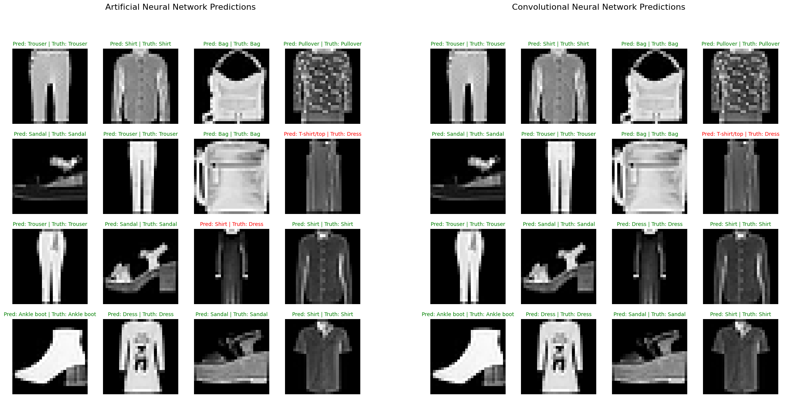
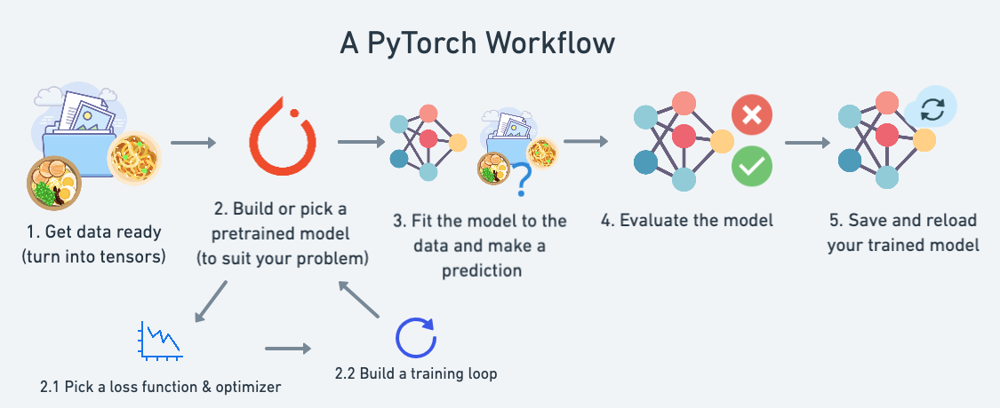
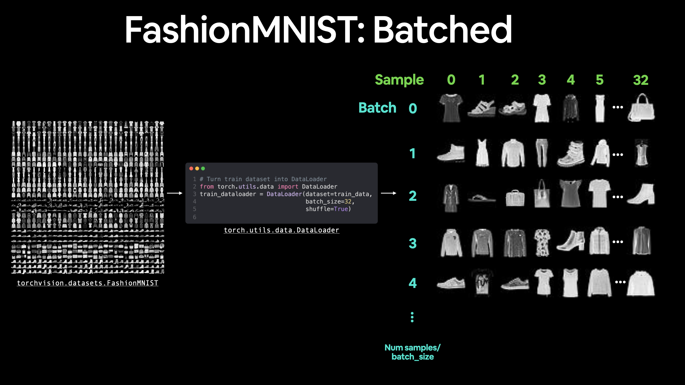
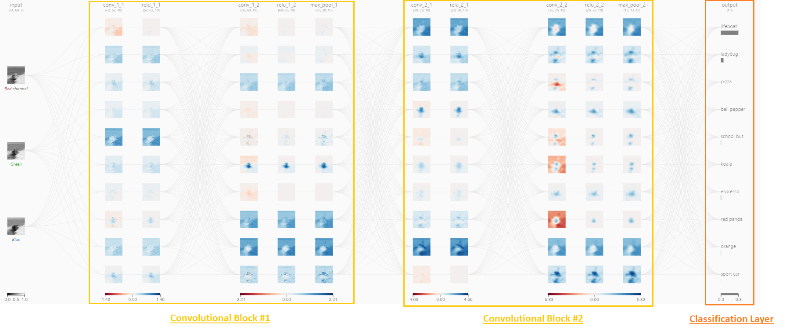
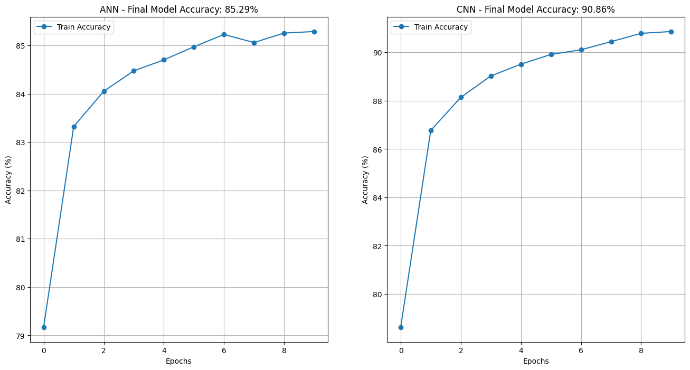
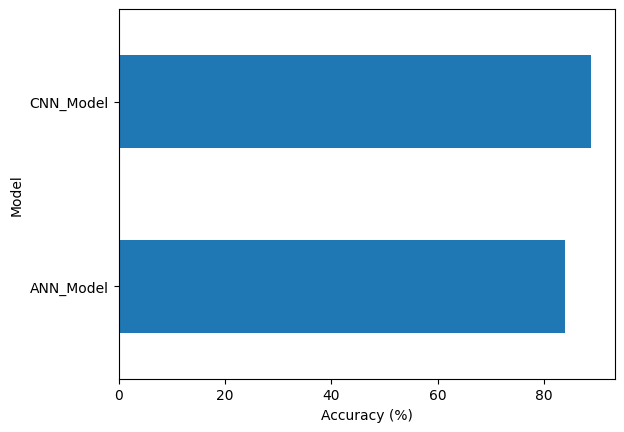
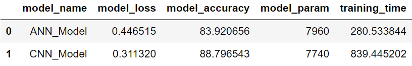

# Comparison Artificial Neural Network vs Convolutional Neural Network for Images Classification

## Description:

To test the performance of a _simple `Convolutional Neural Network`_ a _Baseline_ model using an Artificial Neural Network without `activation functions` (**only linear layers were used**), was built and used as a benchmark.

The experiment aims to compare the performance of both models measuring the level of accuracy of each model to classify correctly a set of images. From the model's point of view the comparison will be only on the **model's architecture**, so the same metaparameters are used to train both models.

**Keywords: `Images Classification,` `Artificial Neural Network,` `Convolutional Neural Network,` `Deep Learning`**

 

 
<i>Comparison of Images Classification by ANN and CNN</i>

 

## Requirements:

- Python 3.9.17
- pytorch
- numpy
- pandas
- matplotlib

## The Pytorch Workflow:

To support the _build, train and test_ process a common workflow.  
The used of a `standard worflow` allows to define a set of parameters and functions that help on each step of the building process.

The parameters and functions defined to support the workflow are:

- The number of batches that data is splitted
- The number of `epochs` to fit the model
- The learning rate
- The loss function selected
- The optimizer selected
- Metrics
- The training loop
- The testing loop
- Make predictions

The next figure shows the workflow applied in the construction of each classification model.

 

 
<i>Common Workflow Applied to Classification Models</i>

 

## The Dataset:

To run the experiment the [Fashion MNIST](https://www.kaggle.com/code/digvijayyadav/fmnist-nn-and-cnn) dataset is used. The dataset is loaded directly from pytorch datasets [repository](https://pytorch.org/vision/main/datasets.html), which is accessed thru `torch.utils.data.Dataset`.

The Fashion MNIST is a dataset of Zalando’s article images consisting of **60,000** training examples and **10,000** test examples. Each example comprises a `28×28` grayscale image and an associated label from one of `10` classes.

While training a model, we typically want to pass samples in “batches”, reshuffle the data at every epoch to reduce model overfitting. To support this operation pytorch offers the use of `Dataloaders` which helps load data into a model for training and for inference, turning a **large dataset** into a Python iterable of smaller chunks that can be set by the `batch_size` parameter.

 

 
<i>Fashion MNIST Dataset Split in Batches</i>

 

## Convolutional Neural Network Model:

The `Convolutional Neural Network` built for the experiment is based on the **_TinyVGG_** architecture explained in [CNN Explainer](https://poloclub.github.io/cnn-explainer/) website.

The `TinyVGG` CNN uses two **convolutional blocks** and a **classification layer**.

 

 
<i>Tiny VGG Architecture</i>

 

CNNs utilize a special type of layer, named a `convolutional layer`, that makes them well-positioned to learn from image and image-like data. Regarding image data, CNNs can be used for many different computer vision tasks, such as image processing, classification, segmentation, and object detection.

## Comparing Performance of The Models:

Looking at the accuracy of both models during the training process, the `CNN` outstand around **5%** better that the `ANN`.

 

 
<i>Comparison. Accuracy Evolution during Training of Both Models</i>

 

Even though it is not a big difference, it can be notice that `CNN` could still improve if the model is trained longer, by the other hand, the `ANN` seems to reach a plateau after the 6th epoch.

The same difference in accuracy is kept by the `CNN` over the `ANN` during validation which is around **5%**. Getting an accuracy of **83.92%** by the `ANN` model and an accuracy of **88.79%** by the `CNN`.

 

 
<i>Comparison. Models Performance</i>

 

**It must be noticed that due to the `CNN` complexity the time needed to train the model took _3 times_ more with respect to the `ANN`, despite of the `ANN` has more parameters.**

 

 
